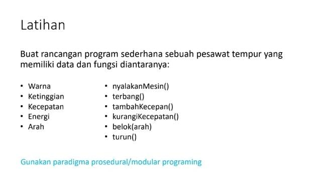
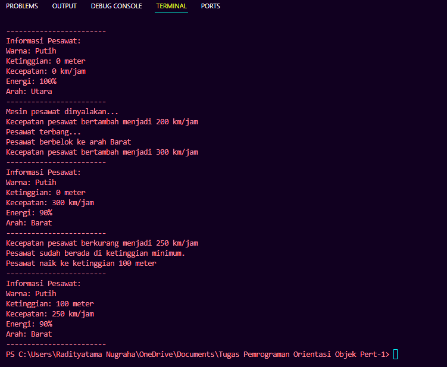

# Tugas Praktikum 1 (Pertemuan ke 2) 

|Nama|NIM|Kelas|Mata Kuliah|
|----|---|-----|------|
|**Romi Rahman**|**312310581**|**TI.23.A6**|**Pemrograman Orientasi Objek**|



# Input Code :
## • Data Pesawat
```
public class PesawatTempur {

    private final String warna;
    private int ketinggian; 
    private int kecepatan; 
    private int energi; 
    private String arah;
    private static final int MAX_KECEPATAN = 900;
    private static final int MAX_KETINGGIAN = 10000; 

    public PesawatTempur(String warna) {
        this.warna = warna;
        this.ketinggian = 0;
        this.kecepatan = 0;
        this.energi = 100;
        this.arah = "Utara";
    }
```
## • Fungsi Untuk Menyalakan Mesin
```
public void nyalakanMesin() {
        System.out.println("Mesin pesawat dinyalakan...");
    }
```
## • Fungsi Untuk Terbang
```
 public void terbang() {
        if (this.kecepatan > 0) {
            if (this.energi >= 10) { 
                this.energi -= 10; // 
                System.out.println("Pesawat terbang...");
            } else {
                System.out.println("Energi tidak cukup untuk terbang.");
            }
        } else {
            System.out.println("Pesawat harus memiliki kecepatan untuk terbang.");
        }
    }
```
## • Fungsi Untuk Menambah Kecepatan
```
public void tambahKecepatan(int kecepatan) {
        this.kecepatan += kecepatan;
        if (this.kecepatan > MAX_KECEPATAN) {
            this.kecepatan = MAX_KECEPATAN; 
        }
        System.out.println("Kecepatan pesawat bertambah menjadi " + this.kecepatan + " km/jam");
    }
```
## • Fungsi Untuk Mengurangi Kecepatan
```
public void kurangiKecepatan(int kecepatan) {
        this.kecepatan -= kecepatan;
        if (this.kecepatan < 0) {
            this.kecepatan = 0; 
        }
        System.out.println("Kecepatan pesawat berkurang menjadi " + this.kecepatan + " km/jam");
    }
```
## • Fungsi Untuk Belok
```
public void belok(String arah) {
        this.arah = arah;
        System.out.println("Pesawat berbelok ke arah " + this.arah);
    }
```
## • Fungsi Untuk Turun
```
public void turun() {
        if (this.ketinggian - 100 >= 0) {
            this.ketinggian -= 100;
            System.out.println("Pesawat turun ke ketinggian " + this.ketinggian + " meter");
        } else {
            System.out.println("Pesawat sudah berada di ketinggian minimum.");
        }
    }
```
## • Fungsi Untuk Naik
```
public void naik() {
        if (this.ketinggian + 100 <= MAX_KETINGGIAN) {
            this.ketinggian += 100;
            System.out.println("Pesawat naik ke ketinggian " + this.ketinggian + " meter");
        } else {
            System.out.println("Tidak dapat naik, sudah mencapai ketinggian maksimum.");
        }
    }
```
## • Fungsi Untuk Menampilkan Informasi Pesawat
```
public void infoPesawat() {
        System.out.println("------------------------");
        System.out.println("Informasi Pesawat:");
        System.out.println("Warna: " + this.warna);
        System.out.println("Ketinggian: " + this.ketinggian + " meter");
        System.out.println("Kecepatan: " + this.kecepatan + " km/jam");
        System.out.println("Energi: " + this.energi + "%");
        System.out.println("Arah: " + this.arah);
        System.out.println("------------------------");
    }
```

## • Membuat Objek Pesawat
```
public static void main(String[] args) {

        PesawatTempur pesawat1 = new PesawatTempur("Putih");
```

## • Menampilkan Informasi awal pesawat
```
        pesawat1.infoPesawat();
```

## • Menyalakan Mesin Pesawat
```
        pesawat1.nyalakanMesin(); 
```

## • Menambah Kecepatan Pesawat
```
        pesawat1.tambahKecepatan(200);
```

## • Terbang
```
        pesawat1.terbang();
```

## • Belok Ke Arah Barat
```
        pesawat1.belok("Barat");
```

## • Menambah Kecepatan Lagi
```
        pesawat1.tambahKecepatan(100);
```

## • Menampilkan Informasi Pesawat
```
        pesawat1.infoPesawat();
```

## • Mengurangi Kecepatan
```
        pesawat1.kurangiKecepatan(50);
```

## • Turun
```
        pesawat1.turun();
```

## • Naik
```
        pesawat1.naik();
```

## • Menampilkan Informasi Pesawat
```
        pesawat1.infoPesawat();
    }
}
```

# Output Code :

